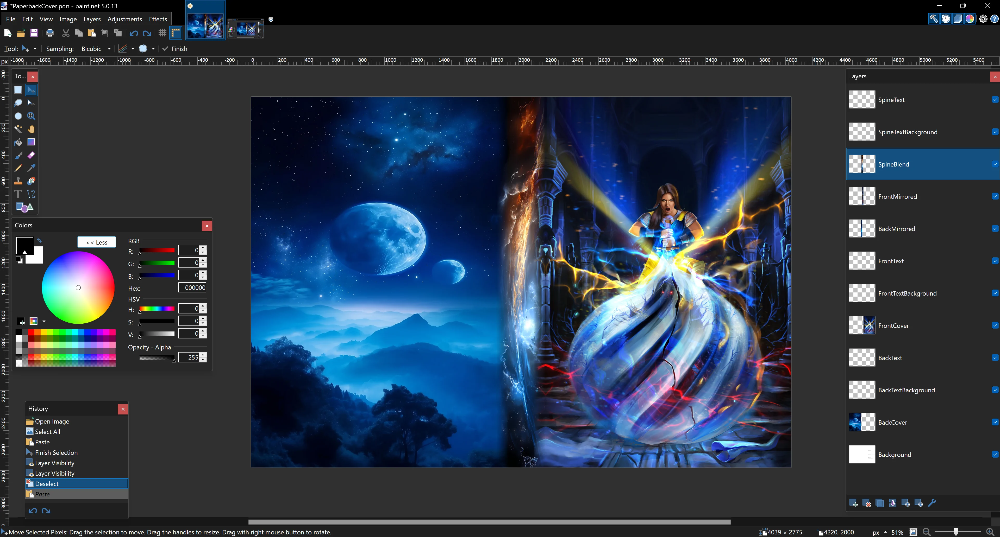

# Book Cover Creator

A book cover requires three parts:
- Back
- Spine
- Front

These images must be arranged at the exact positions, aspect ratios, and sizes to fit perfectly on your cover. This program allows you to focus on creating your back, spine, and front images separately, then splicing them together into a single image which can be uploaded to Amazon or other publisher sites.

Once this program is run, you'll need to use an image editor like Paint.NET, GIMP, etc. that can do layers and assemble the output files.

The order, top down, is:
- Spine blend image
- Back mirror image
- Front mirror image
- Back image
- Front image

The templates folder has a Paint.NET template you can start with.

In this screenshot you can see how I've arranged the layers, including the spine blending with the mirrored version of the front and back.

[Check out my writing site!](https://jeffjohnson.ninja)

